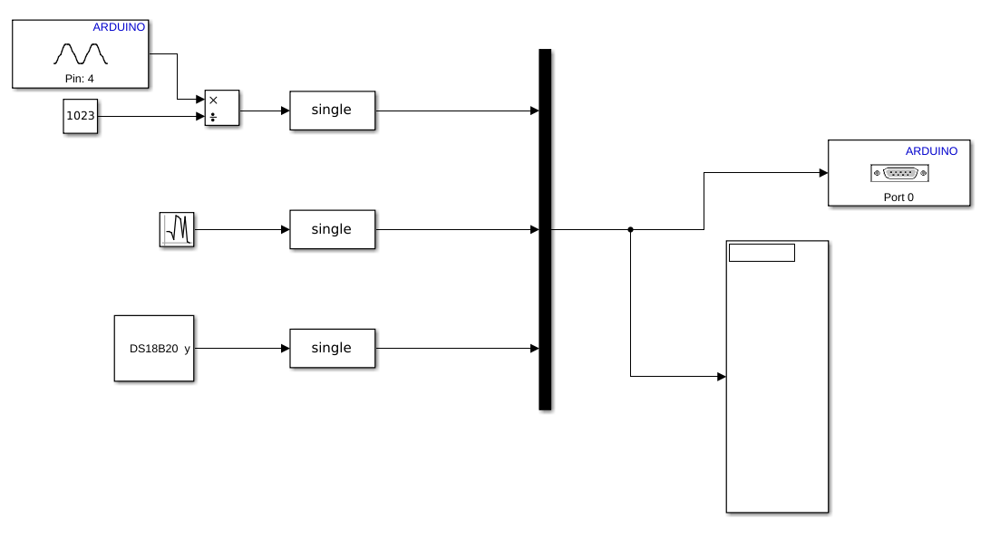
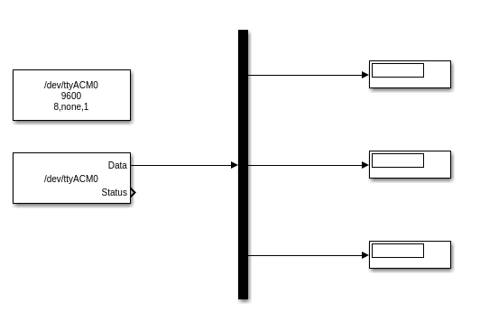

# Arduino model

## Add more channels
To add more channel, simply add a new port on the mux and connect your signal here.

## Write custom model
The `DS18B20` MATLAB system object is an example of implementing a custom block. Use this to realize anything that is not natively supported on MATLAB/Simulink Arduino Support Package.

Also, refer to the [official documentation](https://www.mathworks.com/help/supportpkg/arduino/device-driver-blocks.html) for the implementation details.

## Debug with external mode
The serial port block must be commented if the external mode is intentded. They shares the same serial port channel so that they conflict.

## Deployment
After any change was made, press `Deploy to hardware` to update the model

## Precision (double/single)
[Note the difference of the float precision is not common.](https://www.arduino.cc/reference/en/language/variables/data-types/double/)
> The double datatype occupies 8 bytes (64 bit) on the Arduino Due board and it occupies 4 bytes (32 bit) on the other Arduino boards.

In order to maintain the consistency between PC side and Arduino side, use `single`.

## Start up behavior
In my Arduino UNO board, the everytime the serial port gets connected, it resets. This is a desired behavior. However, it takes some time before the Arduino board starting transmitting the data back to PC. I do not know why this starting delay was caused. Therefore, you should trim the first garbage data.

# PC side

# Matching the data from Arduino

In the serial read block you must make sure the data type (`single`) and the output size (number of elements) matches the one from Arduino.
